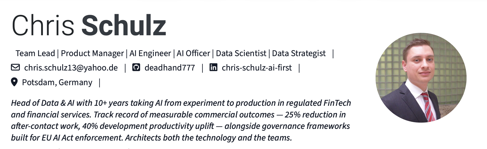

# CV - Chris Schulz

**"Team Lead | Product Manager | AI Engineer | AI Officer | Data Scientist | Data Strategist"**

[](https://github.com/deadhand777/cs_cv/blob/main/cv/cv.pdf)

My current public CV can be found & downloaded [here](https://github.com/deadhand777/cs_cv/blob/main/cv/cv.pdf).

## Specializations

- **Generative AI & LLMs**: RAG, Agents, MCP, Fine-tuning (LoRA/RLHF), LangChain, Strands Agents
- **ML & Data Engineering**: PyTorch, Python, AWS, Apache Iceberg, DuckDB, MLOps
- **Leadership**: AI roadmap, team building, EU AI Act compliance, data governance


## Generate the CV

```bash
cd cv && typst compile cv.typ
```

Output: `cv/cv.pdf` (A4, 2 pages).

## Project Structure

```
cv/                        # Typst CV pipeline (active)
  cv.typ                   # entry point
  profile_en/              # content: professional.typ, skills.typ, education.typ, metadata.toml
  cv.pdf                   # compiled output
man/                       # assets (profile photo, preview image)
Chris_Schulz_CV.yaml       # RenderCV YAML (secondary pipeline)
