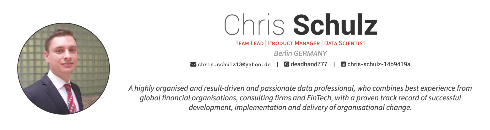

# CV - Chris Schulz

**AI Engineer | LLM Expert | Head of Data & AI | Product Manager**

My current public CV can be found & downloaded [here](https://github.com/deadhand777/cs_cv/blob/main/cv_public/cv_public.pdf).

Specializing in:
- **Generative AI & LLMs**: RAG, Agents, Fine-tuning, Prompt Engineering
- **Machine Learning**: Python, PyTorch, TensorFlow, Scikit-learn
- **Data Strategy**: Building scalable data architectures and AI roadmaps

Further details are available upon request.
